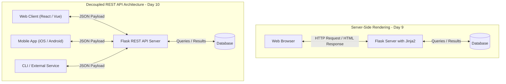
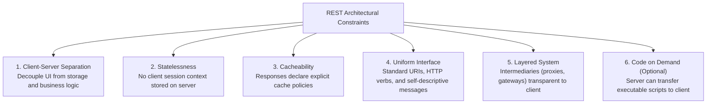
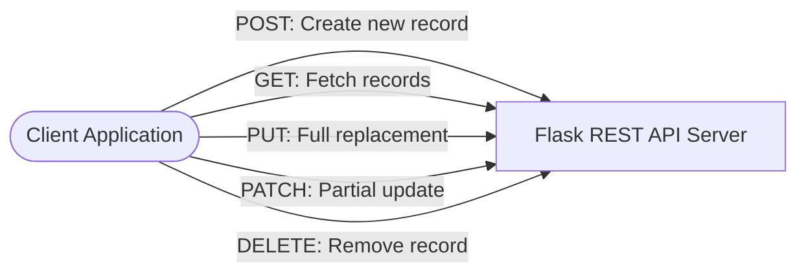
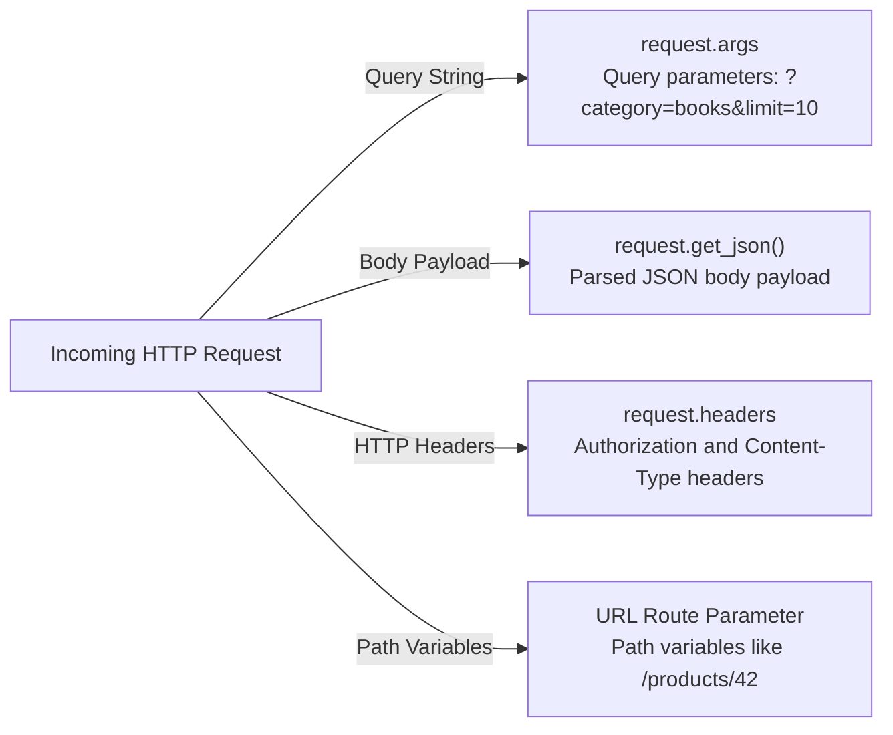

# Day 10: RESTful APIs with Flask & Numerical Computing with NumPy

Welcome to Day 10! Today's session bridges two foundational pillars of modern software engineering and data-driven Python development:

1. **RESTful Web Services using Flask**: Transitioning from traditional server-side rendered HTML applications (covered in Day 9) to building decoupled, stateless JSON web services that power Single Page Applications (React, Angular, Vue), mobile applications (iOS/Android), and distributed microservices.
2. **Numerical Computing with NumPy**: Entering the scientific and data science ecosystem. We explore why standard Python lists are inefficient for numerical computing, how NumPy achieves near-C performance through contiguous memory and vectorization, the mechanics of $N$-dimensional arrays (`ndarray`), indexing/slicing (and the critical view vs. copy distinction), universal functions, broadcasting rules, multi-axis aggregations, and practical data normalization.

---

## Table of Contents

- [Day 10: RESTful APIs with Flask \& Numerical Computing with NumPy](#day-10-restful-apis-with-flask--numerical-computing-with-numpy)
  - [Table of Contents](#table-of-contents)
- [SECTION A: Fundamentals of REST API using Flask](#section-a-fundamentals-of-rest-api-using-flask)
  - [Part 1: Architectural Foundations of REST](#part-1-architectural-foundations-of-rest)
    - [1. What is an API?](#1-what-is-an-api)
    - [2. Server-Side Rendering (SSR) vs. REST API Decoupling](#2-server-side-rendering-ssr-vs-rest-api-decoupling)
    - [3. Roy Fielding's 6 REST Architectural Constraints](#3-roy-fieldings-6-rest-architectural-constraints)
  - [Part 2: RESTful URI Design \& HTTP Semantics](#part-2-restful-uri-design--http-semantics)
    - [1. Resource-Oriented URI Conventions](#1-resource-oriented-uri-conventions)
    - [2. HTTP Verbs in REST Semantics](#2-http-verbs-in-rest-semantics)
    - [3. Safety and Idempotency Matrix](#3-safety-and-idempotency-matrix)
    - [4. Standard HTTP Status Codes in REST APIs](#4-standard-http-status-codes-in-rest-apis)
  - [Part 3: Core Flask Tools for REST APIs](#part-3-core-flask-tools-for-rest-apis)
    - [1. Returning JSON: `jsonify` vs. `json.dumps`](#1-returning-json-jsonify-vs-jsondumps)
    - [2. Parsing Incoming Requests: `request.get_json()` and `request.args`](#2-parsing-incoming-requests-requestget_json-and-requestargs)
    - [3. Dynamic URL Parameters and Variable Converters](#3-dynamic-url-parameters-and-variable-converters)
    - [4. Centralized Error Handling with `@app.errorhandler`](#4-centralized-error-handling-with-apperrorhandler)
  - [Part 4: Practical Project: Building a Products CRUD REST API with Flask \& SQLite](#part-4-practical-project-building-a-products-crud-rest-api-with-flask--sqlite)
    - [1. Project Structure](#1-project-structure)
    - [2. Database Schema \& Helper Module (`database.py`)](#2-database-schema--helper-module-databasepy)
    - [3. The REST API Application (`app.py`)](#3-the-rest-api-application-apppy)
    - [4. Testing Endpoints with `curl`](#4-testing-endpoints-with-curl)

<!-- 

- [SECTION B: Introduction to NumPy \& Practical Applications](#section-b-introduction-to-numpy--practical-applications)
  - [Part 5: Introduction to NumPy \& Its Real-World Uses](#part-5-introduction-to-numpy--its-real-world-uses)
    - [1. What is NumPy?](#1-what-is-numpy)
    - [2. Where is NumPy Used in the Real World?](#2-where-is-numpy-used-in-the-real-world)
    - [3. The Core Object: `ndarray` vs. Python Lists](#3-the-core-object-ndarray-vs-python-lists)
    - [4. NumPy Basics: Creation, Attributes, Slicing \& Vectorization](#4-numpy-basics-creation-attributes-slicing--vectorization)
  - [Part 6: Image Manipulation with NumPy](#part-6-image-manipulation-with-numpy)
    - [1. Digital Images as NumPy Arrays](#1-digital-images-as-numpy-arrays)
    - [2. Loading \& Saving Images with PIL and NumPy](#2-loading--saving-images-with-pil-and-numpy)
    - [3. Converting to Grayscale](#3-converting-to-grayscale)
    - [4. Manipulating Image Color Temperature (Warm vs. Cool Tones)](#4-manipulating-image-color-temperature-warm-vs-cool-tones)
    - [5. Scaling Images (Downscaling \& Upscaling via Slicing \& `np.repeat`)](#5-scaling-images-downscaling--upscaling-via-slicing--nprepeat)
    - [6. Additional Common Manipulations: Flipping, Cropping, and Brightness](#6-additional-common-manipulations-flipping-cropping-and-brightness)
  - [Part 7: Image Steganography: Hiding Secret Messages](#part-7-image-steganography-hiding-secret-messages)
    - [1. What is Steganography?](#1-what-is-steganography)
    - [2. The Concept: Least Significant Bit (LSB) Hiding](#2-the-concept-least-significant-bit-lsb-hiding)
    - [3. Step-by-Step Implementation: Hiding \& Extracting a Secret Message](#3-step-by-step-implementation-hiding--extracting-a-secret-message)
    - [4. Why the Image Looks Completely Unchanged](#4-why-the-image-looks-completely-unchanged)
  - [Summary \& Quick Reference: NumPy, Images \& Steganography](#summary--quick-reference-numpy-images--steganography) -->

---

# SECTION A: Fundamentals of REST API using Flask

---

## Part 1: Architectural Foundations of REST

### 1. What is an API?

An **Application Programming Interface (API)** is a formal contract between two software systems defining how they communicate, what requests can be made, what data formats must be supplied, and what response formats will be returned.

In modern computing, APIs form the connective tissue between:
* Frontend user interfaces (React, Vue, iOS, Android) and backend servers.
* Different microservices running inside a cloud ecosystem (e.g., Payment Service talking to Order Service).
* Third-party integrations (e.g., using Stripe API for payments, Twilio for SMS, Google Maps API for geolocation).

---

### 2. Server-Side Rendering (SSR) vs. REST API Decoupling

In Day 9, we built **Server-Side Rendered (SSR)** applications where Flask generated complete HTML pages using Jinja2 templates. When a client asked for data, the server queried the database, merged data into HTML, and transmitted raw HTML markup back to the browser.

In contrast, **REST APIs decouple presentation from data**:
* The server sends **raw data** (typically JSON payloads).
* The client (browser, mobile app, desktop app, or IoT device) receives this data and is solely responsible for how it gets rendered.



#### Advantages of the REST API Architecture:
1. **Multi-Client Support**: A single Flask backend API can simultaneously serve a web app, an iOS app, an Android app, a CLI tool, and partner integrations.
2. **Bandwidth Efficiency**: Instead of sending 50 KB of repetitive HTML markup, the server sends a 2 KB JSON packet containing only raw values.
3. **Separation of Concerns**: Backend engineers focus exclusively on database efficiency, security, transactions, and business logic. Frontend engineers focus on user experience, styling, accessibility, and UI performance.

---

### 3. Roy Fielding's 6 REST Architectural Constraints

The term **REST** stands for **Representational State Transfer**. It was introduced in 2000 by computer scientist **Roy Fielding** in his doctoral dissertation *"Architectural Styles and the Design of Network-based Software Architectures"*.

To be truly **RESTful**, a system must adhere to six architectural constraints:



1. **Client-Server Separation**:
   * The user interface concerns are separated from the data storage and business logic concerns.
   * This improves user interface portability across multiple platforms and allows backend components to scale independently.
2. **Statelessness**:
   * **Crucial Rule**: The server must not store any session context about the client between requests.
   * Every incoming request must contain **all** the information necessary for the server to authenticate, authorize, and fulfill it (e.g., via API keys, JWT bearer tokens, or authorization headers).
   * **Benefit**: Extreme scalability. Any incoming request can be handled by any server instance in a load-balanced cluster without session synchronization.
3. **Cacheability**:
   * Responses must define themselves as cacheable or non-cacheable using standard HTTP headers (`Cache-Control`, `ETag`, `Expires`).
   * If a response is cacheable, intermediate proxies or client browsers are permitted to reuse that response data for equivalent subsequent requests, reducing latency and network traffic.
4. **Uniform Interface**:
   * The central constraint that distinguishes REST from other network architectures. It comprises four sub-principles:
     * **Identification of Resources**: Every conceptual entity (e.g., a product, a customer) is identified with a unique URI (e.g., `/api/v1/products/42`).
     * **Manipulation of Resources through Representations**: When a client holds a representation of a resource (e.g., JSON), it has enough information to modify or delete the resource on the server (given adequate permissions).
     * **Self-Descriptive Messages**: Each message includes enough metadata (like `Content-Type: application/json`) describing how to process the body.
     * **Hypermedia As The Engine Of Application State (HATEOAS)**: Clients make state transitions dynamically by traversing hypermedia links provided within the response payloads.
5. **Layered System**:
   * The architecture is composed of hierarchical layers (e.g., reverse proxies, load balancers, API gateways, firewall layers).
   * A client cannot tell whether it is communicating directly with the end server or with an intermediary along the path.
6. **Code on Demand (Optional)**:
   * Servers may temporarily extend or customize client functionality by transferring executable code (e.g., JavaScript scripts or compiled WebAssembly applets).

---

## Part 2: RESTful URI Design & HTTP Semantics

### 1. Resource-Oriented URI Conventions

In REST, **URIs identify resources, not actions**. Resources must be modeled as **nouns**, never as verbs.

| Good RESTful Design (Nouns, Pluralized) | Bad Design (RPC Style / Verbs in URL) | Explanation |
| :--- | :--- | :--- |
| `GET /api/v1/products` | `GET /api/v1/getAllProducts` | URIs identify *what* the resource is. HTTP verbs indicate *what to do*. |
| `GET /api/v1/products/42` | `GET /api/v1/getProductById?id=42` | Use path parameters for resource identity. |
| `POST /api/v1/products` | `POST /api/v1/createNewProduct` | `POST` implies resource creation. Don't repeat "create" in the path. |
| `PUT /api/v1/products/42` | `POST /api/v1/updateProduct/42` | Use HTTP `PUT` or `PATCH` to update. |
| `DELETE /api/v1/products/42` | `GET /api/v1/deleteProduct?id=42` | `GET` must be safe and read-only. Never mutate or delete via `GET`. |
| `GET /api/v1/orders/7/items` | `GET /api/v1/getOrderItems?order_id=7` | Express hierarchical relationships naturally using nested paths. |

> [!TIP]
> **API Versioning**: Always prefix API routes with a version number (e.g., `/api/v1/...`). This allows you to publish breaking changes later under `/api/v2/` without disrupting legacy client applications.

---

### 2. HTTP Verbs in REST Semantics

REST maps CRUD (Create, Read, Update, Delete) operations directly to standard HTTP verbs:



* **`GET`**: Retrieve a resource or collection of resources. Query parameters (`?category=electronics&limit=10`) are used for filtering, pagination, and sorting.
* **`POST`**: Create a new subordinate resource. The request body contains the representation of the new resource. The server generates an ID and returns HTTP `201 Created`.
* **`PUT`**: Replace an existing resource in its entirety. The payload must provide the complete set of resource fields. If fields are omitted, the server assumes they should be wiped or set to defaults.
* **`PATCH`**: Apply a partial modification to a resource. Only the specific fields being changed need to be supplied in the request body.
* **`DELETE`**: Permanently remove the specified resource.

---

### 3. Safety and Idempotency Matrix

Two foundational concepts govern HTTP methods in REST:

* **Safe**: The method is strictly read-only and does not mutate the server state. Calling it causes no side-effects.
* **Idempotent**: Making $N$ identical requests ($N \ge 1$) results in the exact same server state as making a single request.

| HTTP Method | Safe? | Idempotent? | Request Body? | Standard Success Status |
| :--- | :---: | :---: | :---: | :--- |
| **`GET`** | **Yes** | **Yes** | No | `200 OK` |
| **`HEAD`** | **Yes** | **Yes** | No | `200 OK` (Headers only) |
| **`POST`** | **No** | **No** | Yes | `201 Created` |
| **`PUT`** | **No** | **Yes** | Yes | `200 OK` or `204 No Content` |
| **`PATCH`** | **No** | **No** | Yes | `200 OK` or `204 No Content` |
| **`DELETE`** | **No** | **Yes** | Optional | `200 OK` or `204 No Content` |

> [!NOTE]
> **Why is `DELETE` idempotent?**
> The first `DELETE /api/products/10` removes product 10 (status `200` or `204`). A second `DELETE /api/products/10` may return `404 Not Found`, but the **state of the database** on the server is unchanged—product 10 remains deleted. Hence, `DELETE` is idempotent.

---

### 4. Standard HTTP Status Codes in REST APIs

Status codes communicate the outcome of the request unambiguously to the client machine:

```
+-------------------------------------------------------------+
| 1xx Informational | 2xx Success       | 3xx Redirection     |
| 4xx Client Error  | 5xx Server Error                        |
+-------------------------------------------------------------+
```

1. **`2xx Success`**:
   * **`200 OK`**: Standard successful response for `GET`, `PUT`, `PATCH`, or `DELETE`.
   * **`201 Created`**: Successfully created a new resource (via `POST`). The response should include the created object in the body and a `Location: /api/v1/products/42` header.
   * **`204 No Content`**: Action succeeded, but the response body is intentionally empty (common for `DELETE` or `PUT`).
2. **`4xx Client Errors`** (The client sent something incorrect):
   * **`400 Bad Request`**: Malformed JSON syntax, invalid payload schema, or failing basic input validation.
   * **`401 Unauthorized`**: Authentication is missing or invalid (e.g., missing API token).
   * **`403 Forbidden`**: Authentication succeeded, but the client does not have permission to access or modify this specific resource.
   * **`404 Not Found`**: The requested URI resource does not exist.
   * **`405 Method Not Allowed`**: The endpoint exists, but the HTTP verb is unsupported (e.g., sending `POST` to a read-only endpoint).
   * **`409 Conflict`**: Request cannot be fulfilled due to a business state conflict (e.g., creating a user with an email that is already registered).
   * **`422 Unprocessable Entity`**: JSON syntax is valid, but internal validation failed (e.g., price is a negative number).
3. **`5xx Server Errors`** (The server crashed or encountered an unhandled exception):
   * **`500 Internal Server Error`**: Unhandled exception in Python code (database crashed, unhandled division by zero, null pointer).

---

## Part 3: Core Flask Tools for REST APIs

### 1. Returning JSON: `jsonify` vs. `json.dumps`

In standard Python, `json.dumps(obj)` serializes a Python dictionary into a JSON string. However, in Flask web services, you should always use **`flask.jsonify()`**.

```python
import json
from flask import Flask, Response, jsonify

app = Flask(__name__)

# Approach A: Raw json.dumps (Avoid in REST APIs)
@app.route("/raw-json")
def raw_json():
    data = {"status": "active", "code": 200}
    # Problem: Defaults to Content-Type: text/html!
    return json.dumps(data)

# Approach B: Flask jsonify (Standard REST approach)
@app.route("/api/status")
def api_status():
    data = {"status": "active", "code": 200}
    # Automatically sets Content-Type: application/json
    return jsonify(data), 200
```

#### Why `jsonify` is Superior:
1. **MIME Type Header**: `jsonify()` automatically sets the HTTP response header `Content-Type: application/json`.
2. **Status Code and Header Tuples**: Flask allows returning a tuple `(jsonify(data), status_code, headers)`, making status code injection seamless.
3. **Configuration Aware**: `jsonify()` respects Flask configuration variables such as `JSON_SORT_KEYS` and custom JSON encoders.

---

### 2. Parsing Incoming Requests: `request.get_json()` and `request.args`

Flask provides the `request` context object to inspect different parts of the incoming HTTP transmission:



```python
from flask import Flask, request, jsonify

app = Flask(__name__)

@app.route("/api/v1/products", methods=["GET", "POST"])
def manage_products():
    if request.method == "GET":
        # 1. Reading Query Parameters: ?category=electronics&limit=10
        category = request.args.get("category", default=None, type=str)
        limit = request.args.get("limit", default=20, type=int)
        
        return jsonify({
            "action": "list_products",
            "filter_category": category,
            "page_limit": limit
        }), 200

    elif request.method == "POST":
        # 2. Reading JSON Body Payload
        # silent=True returns None instead of raising 400 Bad Request if JSON is malformed
        payload = request.get_json(silent=True)
        
        if payload is None:
            return jsonify({
                "error": "Bad Request",
                "message": "Request body must be valid application/json"
            }), 400
            
        # Validate required fields
        if "name" not in payload or "price" not in payload:
            return jsonify({
                "error": "Unprocessable Entity",
                "message": "Missing required fields: 'name' and 'price'"
            }), 422
            
        return jsonify({
            "message": "Product created successfully",
            "received_data": payload
        }), 201
```

> [!IMPORTANT]
> Always use `request.get_json(silent=True)` or wrap `request.get_json()` inside a `try...except` block when accepting client input. By default, calling `request.get_json()` on a request that has an invalid JSON syntax or missing `Content-Type: application/json` header causes Flask to immediately trigger a raw HTTP 400 response.

---

### 3. Dynamic URL Parameters and Variable Converters

Flask allows capturing parts of the URL path directly into your view function using typed converter syntax `<converter:variable_name>`:

| Converter | Matches | Example Route | Match | Reject |
| :--- | :--- | :--- | :--- | :--- |
| `string` (default) | Any text without slashes | `@app.route("/users/<username>")` | `/users/john` | `/users/john/profile` |
| `int` | Positive integers | `@app.route("/api/products/<int:id>")` | `/api/products/42` | `/api/products/laptop` |
| `float` | Positive floating point numbers | `@app.route("/rates/<float:rate>")` | `/rates/3.14` | `/rates/abc` |
| `path` | Accepts slashes | `@app.route("/files/<path:filepath>")` | `/files/docs/readme.txt` | *(empty string)* |
| `uuid` | UUID strings | `@app.route("/orders/<uuid:order_id>")` | `/orders/123e4567-e89b...` | `/orders/99` |

```python
@app.route("/api/v1/products/<int:product_id>", methods=["GET"])
def get_single_product(product_id: int):
    # product_id is guaranteed to be a Python int
    return jsonify({"product_id": product_id, "name": "Mechanical Keyboard"})
```

---

### 4. Centralized Error Handling with `@app.errorhandler`

In a REST API, responses must **never** return raw HTML error tracebacks or standard Apache/Nginx error templates. All errors—including 404 and 500—must be returned in a consistent, machine-readable JSON structure.

```python
from flask import Flask, jsonify

app = Flask(__name__)

@app.errorhandler(404)
def not_found_handler(error):
    return jsonify({
        "success": False,
        "error": "Not Found",
        "message": "The requested resource endpoint does not exist."
    }), 404

@app.errorhandler(405)
def method_not_allowed_handler(error):
    return jsonify({
        "success": False,
        "error": "Method Not Allowed",
        "message": "The HTTP verb used is not permitted for this endpoint."
    }), 405

@app.errorhandler(500)
def internal_server_error_handler(error):
    return jsonify({
        "success": False,
        "error": "Internal Server Error",
        "message": "An unexpected error occurred on the server."
    }), 500
```

---

## Part 4: Practical Project: Building a Products CRUD REST API with Flask & SQLite

Let us implement a complete, robust, production-grade RESTful API for an **Inventory Product Catalog** using Flask and SQLite.

### 1. Project Structure

```
inventory_api/
├── database.py       # SQLite connection and schema migration
├── app.py            # Flask application and REST endpoints
└── inventory.db      # SQLite database file (created automatically)
```

---

### 2. Database Schema & Helper Module (`database.py`)

Create `database.py`. This module handles database connections, sets up `sqlite3.Row` for dictionary-like column access, and initializes the `products` table.

```python
"""
database.py - Database connection management and initialization.
"""

import sqlite3
from typing import Optional

DATABASE_NAME = "inventory.db"


def get_db_connection() -> sqlite3.Connection:
    """
    Creates and returns a thread-safe connection to the SQLite database.
    Configures row_factory to sqlite3.Row for key-based column lookup.
    """
    conn = sqlite3.connect(DATABASE_NAME)
    conn.row_factory = sqlite3.Row
    # Enable Foreign Key enforcement in SQLite
    conn.execute("PRAGMA foreign_keys = ON;")
    return conn


def init_db() -> None:
    """
    Initializes the database schema if tables do not already exist.
    """
    schema_sql = """
    CREATE TABLE IF NOT EXISTS products (
        id INTEGER PRIMARY KEY AUTOINCREMENT,
        name TEXT NOT NULL,
        category TEXT NOT NULL,
        price REAL NOT NULL CHECK (price >= 0),
        stock INTEGER NOT NULL DEFAULT 0 CHECK (stock >= 0),
        created_at TIMESTAMP DEFAULT CURRENT_TIMESTAMP
    );
    """
    with get_db_connection() as conn:
        conn.executescript(schema_sql)
        conn.commit()


if __name__ == "__main__":
    init_db()
    print("Database schema initialized successfully.")
```

---

### 3. The REST API Application (`app.py`)

Create `app.py`. This implements full CRUD capabilities:
* `GET /api/v1/products` - List all products with optional query filtering (`?category=...&min_price=...`)
* `GET /api/v1/products/<int:id>` - Retrieve a single product by ID
* `POST /api/v1/products` - Create a new product with complete validation
* `PUT /api/v1/products/<int:id>` - Full replacement update of a product
* `PATCH /api/v1/products/<int:id>` - Partial field update of a product
* `DELETE /api/v1/products/<int:id>` - Delete a product

```python
"""
app.py - Production-ready Flask RESTful API for Product Inventory.
"""

import sqlite3
from flask import Flask, jsonify, request
from database import get_db_connection, init_db

app = Flask(__name__)

# Initialize database schema upon application launch
init_db()


# -------------------------------------------------------------------------
# Helper Functions
# -------------------------------------------------------------------------

def row_to_dict(row: sqlite3.Row) -> dict:
    """Converts an sqlite3.Row object into a serializable standard Python dictionary."""
    return dict(row)


def json_response(data=None, message: str = "", status_code: int = 200, success: bool = True):
    """Utility helper to produce uniform, standardized API response envelopes."""
    payload = {
        "success": success,
        "status_code": status_code
    }
    if message:
        payload["message"] = message
    if data is not None:
        payload["data"] = data
    return jsonify(payload), status_code


# -------------------------------------------------------------------------
# Centralized Error Handlers
# -------------------------------------------------------------------------

@app.errorhandler(404)
def handle_404(error):
    return json_response(
        message="The requested endpoint or resource was not found.",
        status_code=404,
        success=False
    )


@app.errorhandler(405)
def handle_405(error):
    return json_response(
        message=f"HTTP verb '{request.method}' is not allowed for this route.",
        status_code=405,
        success=False
    )


@app.errorhandler(500)
def handle_500(error):
    return json_response(
        message="An unexpected server error occurred.",
        status_code=500,
        success=False
    )


# -------------------------------------------------------------------------
# REST API Endpoints: /api/v1/products
# -------------------------------------------------------------------------

@app.route("/api/v1/products", methods=["GET"])
def get_products():
    """
    GET /api/v1/products
    Retrieves all products.
    Supports query parameters for filtering:
      - ?category=<name>
      - ?min_price=<value>
      - ?limit=<number>
    """
    category = request.args.get("category", default=None, type=str)
    min_price = request.args.get("min_price", default=None, type=float)
    limit = request.args.get("limit", default=50, type=int)

    query = "SELECT * FROM products WHERE 1=1"
    params = []

    if category:
        query += " AND LOWER(category) = LOWER(?)"
        params.append(category)

    if min_price is not None:
        query += " AND price >= ?"
        params.append(min_price)

    query += " ORDER BY id DESC LIMIT ?"
    params.append(limit)

    with get_db_connection() as conn:
        cursor = conn.cursor()
        cursor.execute(query, tuple(params))
        rows = cursor.fetchall()

    products = [row_to_dict(row) for row in rows]
    return json_response(data=products, status_code=200)


@app.route("/api/v1/products/<int:product_id>", methods=["GET"])
def get_product(product_id: int):
    """
    GET /api/v1/products/<id>
    Retrieves a single product by its primary key ID.
    Returns 404 if not found.
    """
    with get_db_connection() as conn:
        cursor = conn.cursor()
        cursor.execute("SELECT * FROM products WHERE id = ?", (product_id,))
        row = cursor.fetchone()

    if row is None:
        return json_response(
            message=f"Product with ID {product_id} does not exist.",
            status_code=404,
            success=False
        )

    return json_response(data=row_to_dict(row), status_code=200)


@app.route("/api/v1/products", methods=["POST"])
def create_product():
    """
    POST /api/v1/products
    Creates a new product record.
    Required JSON fields: 'name', 'category', 'price', 'stock'
    """
    body = request.get_json(silent=True)
    if body is None:
        return json_response(
            message="Request body must be a valid JSON object with 'Content-Type: application/json'.",
            status_code=400,
            success=False
        )

    # Validate presence of required attributes
    required_fields = ["name", "category", "price", "stock"]
    missing_fields = [f for f in required_fields if f not in body]
    if missing_fields:
        return json_response(
            message=f"Missing required fields: {', '.join(missing_fields)}",
            status_code=422,
            success=False
        )

    name = str(body["name"]).strip()
    category = str(body["category"]).strip()

    try:
        price = float(body["price"])
        stock = int(body["stock"])
        if price < 0 or stock < 0:
            raise ValueError()
    except (ValueError, TypeError):
        return json_response(
            message="'price' must be a non-negative float and 'stock' must be a non-negative integer.",
            status_code=422,
            success=False
        )

    if not name or not category:
        return json_response(
            message="'name' and 'category' cannot be empty strings.",
            status_code=422,
            success=False
        )

    with get_db_connection() as conn:
        cursor = conn.cursor()
        cursor.execute(
            "INSERT INTO products (name, category, price, stock) VALUES (?, ?, ?, ?)",
            (name, category, price, stock)
        )
        conn.commit()
        new_id = cursor.lastrowid

        cursor.execute("SELECT * FROM products WHERE id = ?", (new_id,))
        new_product = row_to_dict(cursor.fetchone())

    # Build response with 201 Created and Location header
    response = jsonify({
        "success": True,
        "status_code": 201,
        "message": "Product created successfully.",
        "data": new_product
    })
    response.status_code = 201
    response.headers["Location"] = f"/api/v1/products/{new_id}"
    return response


@app.route("/api/v1/products/<int:product_id>", methods=["PUT"])
def replace_product(product_id: int):
    """
    PUT /api/v1/products/<id>
    Idempotent complete replacement of a product record.
    All required fields must be supplied.
    """
    body = request.get_json(silent=True)
    if body is None:
        return json_response(
            message="Invalid or missing JSON payload.",
            status_code=400,
            success=False
        )

    # Full replacement requires all mandatory fields
    required_fields = ["name", "category", "price", "stock"]
    missing = [f for f in required_fields if f not in body]
    if missing:
        return json_response(
            message=f"PUT requires all fields for complete resource replacement: {', '.join(missing)}",
            status_code=422,
            success=False
        )

    try:
        price = float(body["price"])
        stock = int(body["stock"])
        if price < 0 or stock < 0:
            raise ValueError()
    except (ValueError, TypeError):
        return json_response(
            message="Invalid numeric values for price or stock.",
            status_code=422,
            success=False
        )

    with get_db_connection() as conn:
        cursor = conn.cursor()
        cursor.execute("SELECT id FROM products WHERE id = ?", (product_id,))
        if cursor.fetchone() is None:
            return json_response(
                message=f"Product with ID {product_id} not found.",
                status_code=404,
                success=False
            )

        cursor.execute(
            """
            UPDATE products
            SET name = ?, category = ?, price = ?, stock = ?
            WHERE id = ?
            """,
            (body["name"], body["category"], price, stock, product_id)
        )
        conn.commit()

        cursor.execute("SELECT * FROM products WHERE id = ?", (product_id,))
        updated = row_to_dict(cursor.fetchone())

    return json_response(data=updated, message="Product replaced successfully.", status_code=200)


@app.route("/api/v1/products/<int:product_id>", methods=["PATCH"])
def patch_product(product_id: int):
    """
    PATCH /api/v1/products/<id>
    Partial update. Only the fields present in the request body are updated.
    """
    body = request.get_json(silent=True)
    if not body or not isinstance(body, dict):
        return json_response(
            message="Valid JSON payload required for partial update.",
            status_code=400,
            success=False
        )

    allowed_fields = {"name", "category", "price", "stock"}
    update_fields = [k for k in body.keys() if k in allowed_fields]

    if not update_fields:
        return json_response(
            message=f"No valid update fields supplied. Allowed: {allowed_fields}",
            status_code=422,
            success=False
        )

    # Build dynamic SQL update string
    set_clauses = []
    params = []
    for field in update_fields:
        val = body[field]
        if field == "price":
            try:
                val = float(val)
                if val < 0:
                    raise ValueError()
            except (ValueError, TypeError):
                return json_response(message="Price must be a non-negative float.", status_code=422, success=False)
        elif field == "stock":
            try:
                val = int(val)
                if val < 0:
                    raise ValueError()
            except (ValueError, TypeError):
                return json_response(message="Stock must be a non-negative integer.", status_code=422, success=False)

        set_clauses.append(f"{field} = ?")
        params.append(val)

    params.append(product_id)
    sql = f"UPDATE products SET {', '.join(set_clauses)} WHERE id = ?"

    with get_db_connection() as conn:
        cursor = conn.cursor()
        cursor.execute("SELECT id FROM products WHERE id = ?", (product_id,))
        if cursor.fetchone() is None:
            return json_response(
                message=f"Product with ID {product_id} not found.",
                status_code=404,
                success=False
            )

        cursor.execute(sql, tuple(params))
        conn.commit()

        cursor.execute("SELECT * FROM products WHERE id = ?", (product_id,))
        updated = row_to_dict(cursor.fetchone())

    return json_response(data=updated, message="Product patched successfully.", status_code=200)


@app.route("/api/v1/products/<int:product_id>", methods=["DELETE"])
def delete_product(product_id: int):
    """
    DELETE /api/v1/products/<id>
    Idempotently deletes a product record.
    """
    with get_db_connection() as conn:
        cursor = conn.cursor()
        cursor.execute("SELECT id FROM products WHERE id = ?", (product_id,))
        row = cursor.fetchone()

        if row is None:
            return json_response(
                message=f"Product with ID {product_id} not found.",
                status_code=404,
                success=False
            )

        cursor.execute("DELETE FROM products WHERE id = ?", (product_id,))
        conn.commit()

    return json_response(message=f"Product with ID {product_id} has been deleted.", status_code=200)


if __name__ == "__main__":
    # In development: debug=True allows hot-reload and informative terminal traces
    app.run(host="127.0.0.1", port=5000, debug=True)
```

---

### 4. Testing Endpoints with `curl`

To test your REST API without a frontend, use `curl` from your terminal:

#### 1. Create a Product (`POST`):
```bash
curl -X POST http://127.0.0.1:5000/api/v1/products \
     -H "Content-Type: application/json" \
     -d '{
           "name": "Wireless Mechanical Keyboard",
           "category": "Electronics",
           "price": 89.99,
           "stock": 35
         }'
```
**Response (`HTTP 201 Created`):**
```json
{
  "data": {
    "category": "Electronics",
    "created_at": "2026-09-07 10:15:32",
    "id": 1,
    "name": "Wireless Mechanical Keyboard",
    "price": 89.99,
    "stock": 35
  },
  "message": "Product created successfully.",
  "status_code": 201,
  "success": true
}
```

#### 2. Retrieve All Products with Filter (`GET`):
```bash
curl -X GET "http://127.0.0.1:5000/api/v1/products?category=Electronics&min_price=50"
```

#### 3. Retrieve Single Product by ID (`GET`):
```bash
curl -X GET http://127.0.0.1:5000/api/v1/products/1
```

#### 4. Partial Update of Stock (`PATCH`):
```bash
curl -X PATCH http://127.0.0.1:5000/api/v1/products/1 \
     -H "Content-Type: application/json" \
     -d '{"stock": 40}'
```

#### 5. Delete Product (`DELETE`):
```bash
curl -X DELETE http://127.0.0.1:5000/api/v1/products/1
```

---
