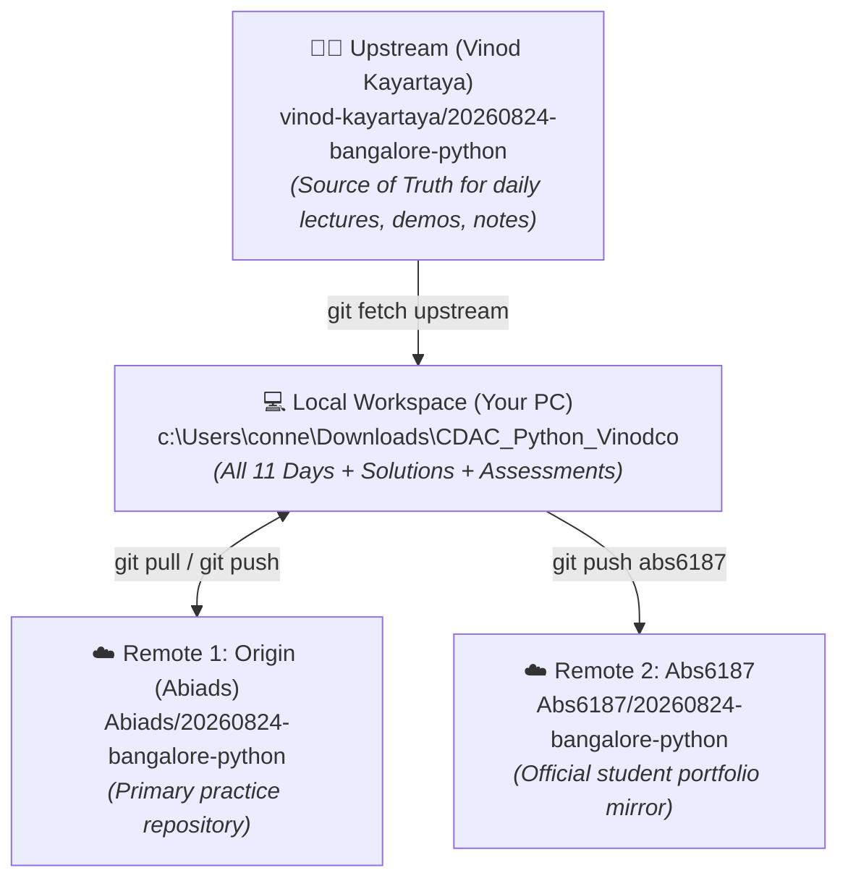
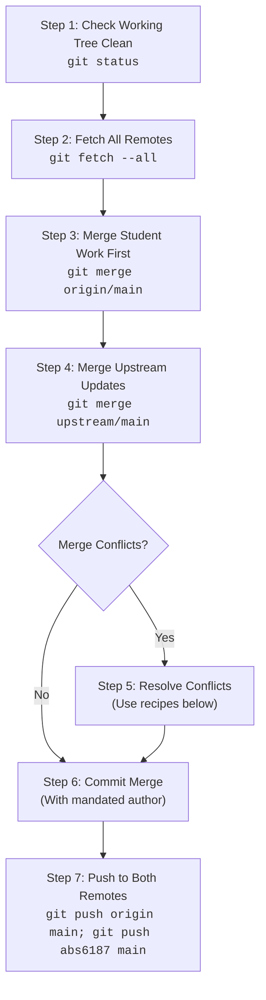

# Git Sync & Conflict Resolution Guide: Upstream (Vinod) to Local/Fork

This guide provides a step-by-step procedure for safely syncing updates from the instructor repository (**Vinod Kayartaya**) into our customized repository (**Abiads** / **Abs6187**) while preventing data loss, resolving Git conflicts, and maintaining dual remote backups.

---

## 1. Remote Repository Architecture

Our setup operates on a **triangular Git workflow**:



### Remote Configuration Check
To verify your remotes are set correctly, run:
```powershell
git remote -v
```

Expected output:
* `upstream` -> `https://github.com/vinod-kayartaya/20260824-bangalore-python.git`
* `origin`   -> `https://github.com/Abiads/20260824-bangalore-python.git`
* `abs6187`  -> `https://github.com/Abs6187/20260824-bangalore-python.git`

*(If `upstream` is missing, add it with: `git remote add upstream https://github.com/vinod-kayartaya/20260824-bangalore-python.git`)*

---

## 2. Why Conflicts Happen Between Vinod's Repo & Ours

| Conflict Cause | Why it Happens | Our Strategy |
| :--- | :--- | :--- |
| **`.gitignore` conflicts** | Upstream sometimes ignores upcoming days (e.g. `Day_10`, `Day_11`, `Assessment`) to hide them until taught. | **Keep our `.gitignore`** so all 11 days and assessments remain tracked and preserved. |
| **`Day_XX/README.md` (`add/add`)** | Upstream creates a new Day note (e.g., Day 09) while we already created a placeholder or structured notes. | **Accept Upstream (`--theirs`)** to get Vinod's authentic lecture notes and diagrams. |
| **Missing files / Delete conflicts** | Upstream doesn't have our custom assignment templates, solutions, or practice assessments. | **Keep Ours (`--ours`)**; never let upstream delete local practice files. |
| **Work from Web / Multi-device** | You completed an assignment on another machine and pushed to `origin`. | **Merge `origin/main` FIRST** before fetching and merging `upstream/main`. |

---

## 3. The 7-Step Standard Sync Protocol

Follow these exact steps every time you want to pull new updates from Vinod:



---

### Step 1: Ensure Local Tree is Clean
Make sure you don't have uncommitted edits before starting:
```powershell
git status
```
If you have work in progress, commit it first:
```powershell
git add .
git commit --author="abs6187 <23f2000876@ds.study.iitm.ac.in>" -m "Save local progress before sync"
```

---

### Step 2: Fetch from All Remotes
Fetch the latest commits from all three remotes without modifying your working files:
```powershell
git fetch origin; git fetch upstream; git fetch abs6187
```

Check what new commits exist in upstream:
```powershell
git log HEAD..upstream/main --oneline
```

---

### Step 3: Merge Student Progress from `origin` First
Always merge your own fork (`origin/main`) first so your assignment progress is protected:
```powershell
git merge origin/main
```

---

### Step 4: Merge Upstream Instructor Updates
Now trigger the merge from Vinod's repository:
```powershell
git merge upstream/main -m "Merge upstream updates from vinod-kayartaya"
```

---

## 4. Conflict Resolution Recipes (Step-by-Step)

If Git outputs `CONFLICT (content)` or `CONFLICT (add/add)`, resolve using these recipes:

### Scenario A: New Day Lecture Notes & Code (`Day_XX/README.md`, `workspace/`)
When Vinod pushes new official notes or lecture workspace code:
* **Rule**: Take Vinod's version (`--theirs`) for lecture content.
```powershell
# Accept upstream's README and workspace files
git checkout --theirs Day_09/README.md
git add Day_09/README.md
```

### Scenario B: `.gitignore` Conflict
Upstream's `.gitignore` may conflict with our repository tracking rules:
* **Rule**: Keep standard ignore rules (`__pycache__`, `.DS_Store`, `temp`), but **do not** ignore `Day_10`, `Day_11`, or `practice_assessment_qp`.
1. Open `.gitignore` and ensure it only contains:
```gitignore
**/__pycache__
*.zip
**/.DS_Store
.DS_Store
**/temp
book_cover.jpg
Python_Learning_Material.html
Python_Learning_Material.md
**/settings.json
```
2. Mark resolved:
```powershell
git add .gitignore
```

### Scenario C: Custom Assignment Boilerplates or Solutions (`delete/modify` or `both modified`)
If upstream attempts to delete or overwrite custom assignments in `Day_XX/assignment/` or `practice_assessment_qp/`:
* **Rule**: Keep our local version (`--ours`).
```powershell
# Keep our local version
git checkout --ours Day_XX/assignment/<file_name>.py
git add Day_XX/assignment/<file_name>.py
```

### Scenario D: If Upstream Deleted a File We Want to Keep
If Git reports `CONFLICT (modify/delete): <file> deleted in upstream/main and modified in HEAD`:
```powershell
# Keep the file
git checkout --ours <file_path>
git add <file_path>
```

---

## 5. Step 6: Commit the Merge with Mandated Author

> [!IMPORTANT]
> **Mandatory Author Rule**: Always commit with author `abs6187 <23f2000876@ds.study.iitm.ac.in>`.

```powershell
git commit --author="abs6187 <23f2000876@ds.study.iitm.ac.in>" -m "Merge upstream updates: Day 09 content, PDF, and Flask workspaces"
```

---

## 6. Step 7: Push to Dual Remotes (`origin` & `abs6187`)

Synchronize your merged `main` branch to both GitHub repositories:

```powershell
git push origin main; git push abs6187 main
```

---

## 7. Emergency Cheat Sheet & Safety Commands

| Goal | Command |
| :--- | :--- |
| **Check which files have conflicts** | `git status` (Look under `Unmerged paths`) |
| **Accept Upstream version of a file** | `git checkout --theirs <path/to/file>` |
| **Keep Our version of a file** | `git checkout --ours <path/to/file>` |
| **View differences before choosing** | `git diff --theirs <path/to/file>` |
| **Cancel the merge safely (Abort)** | `git merge --abort` |
| **View visual commit graph** | `git log --oneline --graph -n 10` |
| **Check sync status against remotes** | `git status -uno` |

---

## 8. Summary Checklist

- [ ] Fetched from all remotes (`origin`, `upstream`, `abs6187`).
- [ ] Merged `origin/main` first to preserve student solutions.
- [ ] Merged `upstream/main`.
- [ ] Lecture materials accepted from upstream (`--theirs`).
- [ ] All 11 day folders and practice assessments preserved (`--ours`).
- [ ] Committed with `--author="abs6187 <23f2000876@ds.study.iitm.ac.in>"`.
- [ ] Pushed successfully to both `origin` and `abs6187`.
